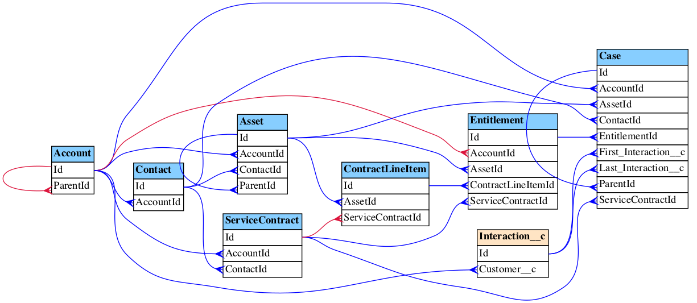

# Salesforce Data model Multi Viewer (SFDMMV)

## Purpose
The pupose of this project is to help to provide a tool to:
1. Segment Salesforce Data Model to ease of use and understanding 
2. Generate multiple ERD views of the Salesforce ORG Data Model
3. Generate Data Dictionaries for the whole model or for segments

### Example of the generated ERD diagram showing all paths between Account and Case SObjects

## Bird View
This is MVP command line implementation of the SFDMMV. It is using the following 3-d party tools:
1. Salesforce command line client **sfdx**
2. Graphviz open source command line tool for visualization

Generated Data Dictionary is in the Excel **.xlsx** format. It will work with Microsoft Excel or LibreOffice. It will not work with Google Office due to the fact, that links between Excel sheets works differently over there.

## MVP Usage
This repository has a binaries generated for:
- MAC OS X - **dmmv-cli-mac**
- Windows - **dmmv-cli-win**
- Linux - **dmmv-cli-lnx**

Command line app expects some paramters:

    Usage of ./bin/dmmv-cli-mac:
      -dmmv:action string
        	one of: list_objs,erd,erd_related,erd_around,erd_conn_paths,data_dict (default "erd")
      -dmmv:cfg:dir string
        	path to the directory with cfg files
      -dmmv:cfg:filters string
    	    name of the dmmv's filters config json file (default "dmmv-cli.filters.json")
      -dmmv:cfg:general string
        	name of the dmmv general config json file (default "dmmv-cli.cfg.json")
      -dmmv:cfg:viewers string
        	name of the dmmv's views config json file (default "dmmv-cli.views.json")
      -dmmv:erd:levels int
        	number of related levels around an object (default 1)
      -dmmv:filter string
        	(mandatory) id of the filter from the json configuration file
      -dmmv:meta:refresh
        	Refresh metadata for dmmv
      -dmmv:viewer string
        	(mandatory) id of the viewer from the json configuration file

### Configuration files:

#### General Configuration File in the JSON format:

    <pre>
    {
        "// modelRootdir": "Directory where Metadata, generated by SFDX is located. in the typical project it is under PROJ_ROOT_PATH/force-app/main/default", 
        
        "modelRootdir": "./force-app/main/default",
      
        "// sfdxPath": "Path to the SFDX CLI executable",

        "sfdxPath": "/usr/local/bin/sfdx",

        "// metaTypes": "Array of the SF Metadata Types to be refreshed",
      
        "metaTypes" : [
            {
                "type": "CustomObject",
                "members": [ "*" ]
            },
            {
                "type": "GlobalValueSet",
                "members": [ "*" ]
            }
        ],
        "logCfg": {
            "// formatter": "text; json",
    
            "formatter" : "text",
    
            "// level": "Possible values: trace; debug; info; error; fatal; warn; panic",
    
            "level": "info",

            "// output": "Possible values: stderr; stdout;",
            
            "output": "stderr"
        }
    }
    </pre>

#### Filter configuration File Example

    <pre>
    {
        "filters": [
            {
                "id": "Standard+DefaultCustom+FinServ",
                
                "sobjConds": [
                    {
                        "isForExclude": true,
                        "attr": "APIName",
                        "regexp": [
                            "^AM_Financial",
                            "^Insurance",
                            "^MMD_*",
                            "^User$",
                            "^__Audit__c$",
                            ".*__kav$",
                            ".*__mdt$",
                            "^AAKCS__[^_]+.*__c$",
                            "^MaritzCX__[^_]+.*__c$",
                            "^SBQQ__[^_]+.*__c$",
                            "^copado__[^_]+.*__c$",
                            "^mkto_si__[^_]+.*__c$",
                            "^sbaa__[^_]+.*__c$",
                            "^seismic__[^_]+.*__c$",
                            "^sortablegrid__[^_]+.*__c$"
                        ]
                    },
                    {
                        "attr": "APIName",
                        "// enum": ["Group"],
                        "regexp": [".+__c$", ".*[^_][^_][^c]$"]
                    }
                ]
            },
            {
                "id": "TargetObjects",
    
                "sobjConds": [
                    {
                        "attr": "APIName",
                        "enum": [
                            "Exception__c",
                            "BatchStatus__c",
                            "Customer_Account_Relation__c",
                            "BatchConditions__c"
                        ],
                        "///regexp": [
                            ".*Contact.*", ".*Referrer.*"
                        ]
                    }
                ]
            },
            {
                "id": "ListAllObjects",
    
                "sobjConds": [
                    {
                        "isForExclude": true,
                        "attr": "APIName",
                        "regexp": [
                            "^Insurance.*",
                            ".*__kav$",
                            ".*__mdt$",
                            "^AAKCS__[^_]+.*__c$",
                            "^MaritzCX__[^_]+.*__c$",
                            "^SBQQ__[^_]+.*__c$",
                            "^copado__[^_]+.*__c$",
                            "^mkto_si__[^_]+.*__c$",
                            "^sbaa__[^_]+.*__c$",
                            "^seismic__[^_]+.*__c$",
                            "^sortablegrid__[^_]+.*__c$"
                        ]
                    },
                    {
                        "attr": "APIName",
                        "regexp": ["^FinServ__", "[^_]+__c$", ".*[^_][^_][^c]$"] 
                    }
                ]
            },
            {
      
                "id": "ObjsConnectedPaths",
    
                "sobjConds": [
                    {
                        "attr": "APIName",
                        "enum": [
                            "Account", "Case"
                        ]
                    }
                ]
            }
        ]
    }
    </pre>

#### View configuration files example

    <pre>
    {
        "viewers": [
            {
                "id": "default",

                "outputDir": "./output",
                "dataDictSuffix": "iDMMV-01",
                "lookupColor": "blue",
                "masterDetailColor": "crimson",
                "namespaces": [
                    {
                        "namespace": "c",
                        "color": "black",
                        "bgColor": "bisque",
                        "stdColor": "black",
                        "stdBgColor": "skyblue1"
                    },
                    {
                        "namespace": "FinServ",
                        "color": "black",
                        "bgColor": "aquamarine"
                    },
                    {
                        "namespace": "SBQQ",
                        "color": "blue",
                        "bgColor": "yellow"
                    },
                    {
                        "namespace": "sbaa",
                        "color": "blue",
                        "bgColor": "greenyellow"
                    },
                    {
                        "namespace": "copado",
                        "color": "blue",
                        "bgColor": "lemonchiffon"
                    },
                    {
                        "namespace": "mkto_si",
                        "color": "white",
                        "bgColor": "mediumpurple1"
                    }
                ],
                "// fieldsInfo": "Possible values: none; FKs; All",
                "fieldsInfo": "FKs"
            }
        ]
    }
    </pre>

## Run DMMV-CLI application

1. Make sure **sfdx** is installed
2. Make sure that **graphviz** package is installed.
3. Create Salesoforce project, connect to the target ORG (see **sfdx* documentation)
4. Retrieve metadata from the target ORG 
5. Create configuration files will all filters you need (see cfg dir)
6. Create symbolic link to the **dmmv-cli** pointing to the binary compiled for your OS (tested in MAC only)
7. Modify start shell scripts if any
8. Run        

## Future
Application is in the active development. Future versions will be open-sourced if my employer will allow that. It will be set of the Microservices with the WEB UI capable to work with many ORGs and many Data Models and their comparisons. 

It will allow to easier access, creation and modification of the Segments, Views and Data Dictionaries. 

Also it will be able to help with Data model governance in the form of anlysis and recommendations (naming style; descriptions; recommendations for optimizations).

Dependencies on the **sfdx** and **dot** from **graphviz** will be eliminated
